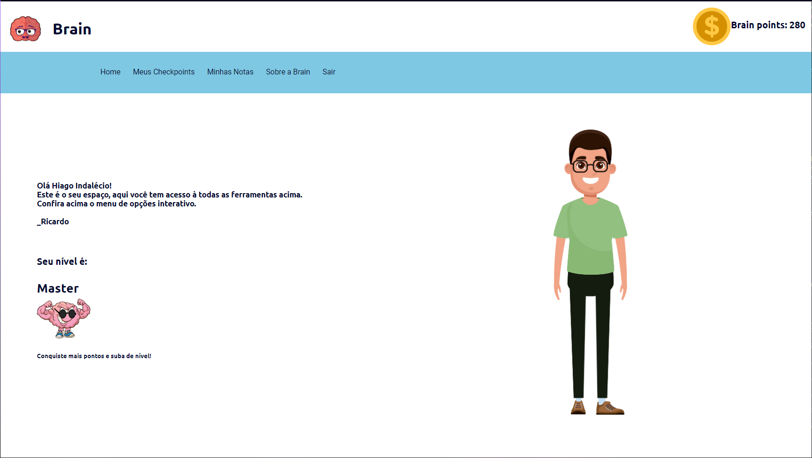
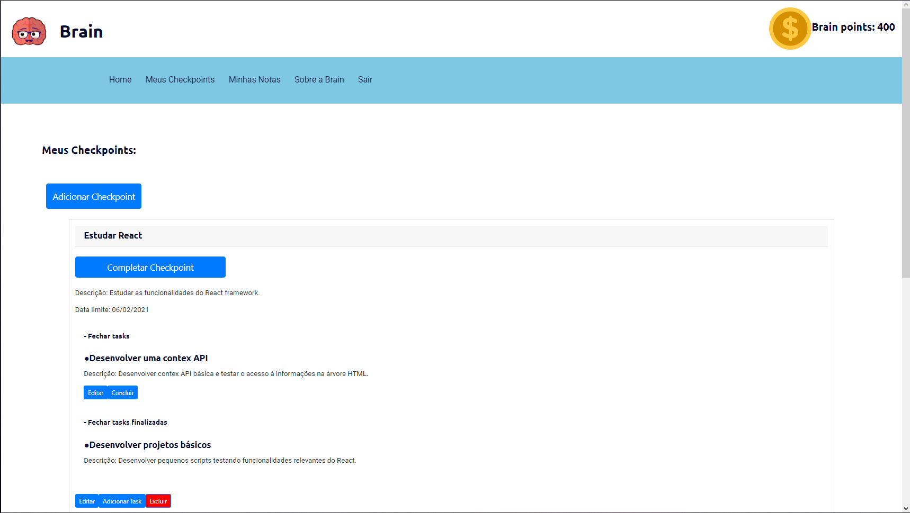

# Brain 🧠

Este projeto se baseia em uma aplicação desenvolvida para incentivar pessoas a trabalharem em projetos pessoais com a possibilidade de manter memórias salvas e controlar check points ligados ao aprendizado, trabalhando assim a mente e promovendo a desenvolvimento pessoal!

# Um pouco sobre o projeto 👁

O projeto se constitui de uma infraestrutura baseada em uma API REST desenvolvida utilizando o framework Express em conjunto ao banco de dados, e uma aplicação REST interligada à API Rest por meio de uma context API. Dentre as tecnologias paralelas utilizadas temos o Typescript para uma melhor estruturação do código e o knex que se demonstrou um ótimo query builder na integração com o banco de dados.

# 💻 Tecnologias
* <a href="https://nodejs.org/en/">Node.js<a/>
* <a href="https://pt-br.reactjs.org">React<a/>
* <a href="https://expressjs.com/pt-br/">Express<a/>
