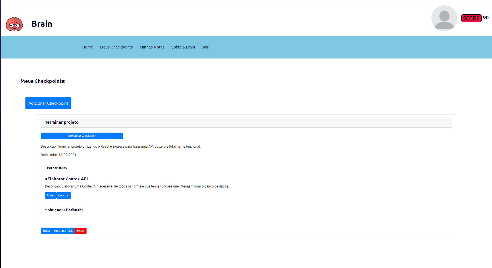

# ATENÇÂO - ESTE DIRETÓRIO ESTÁ EM DESENVOLVIMENTO

# Brain 🧠

Este projeto se baseia em uma aplicação desenvolvida para incentivar pessoas a trabalharem em projetos pessoais com a possibilidade de manter memórias salvas e controlar check points ligados ao aprendizado, trabalhando assim a mente e promovendo a desenvolvimento pessoal!

# 💻 Tecnologias
* <a href="https://nodejs.org/en/">Node.js<a/>
* <a href="https://pt-br.reactjs.org">React<a/># Brain
Aplicação cujo o objetivo 
